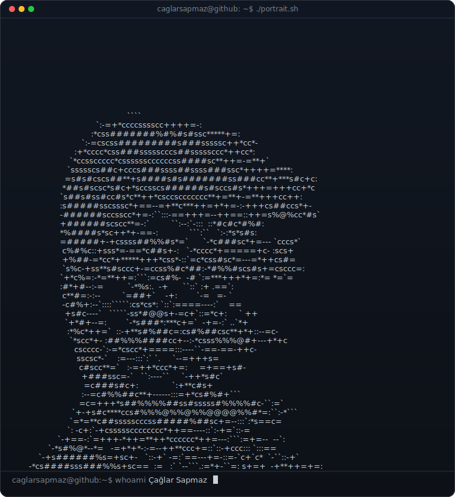
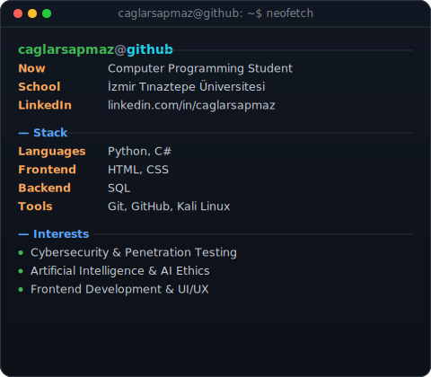

<!--
  GitHub profil README — caglarsapmaz/caglarsapmaz reposu
-->

<table>
<tr>
<td valign="top"></td>
<td valign="top"></td>
</tr>
</table>

## Çağlar Sapmaz

**Computer Programming Student**

 

<!-- Katkı grafiği, her gün GitHub Actions tarafından güncellenir -->

